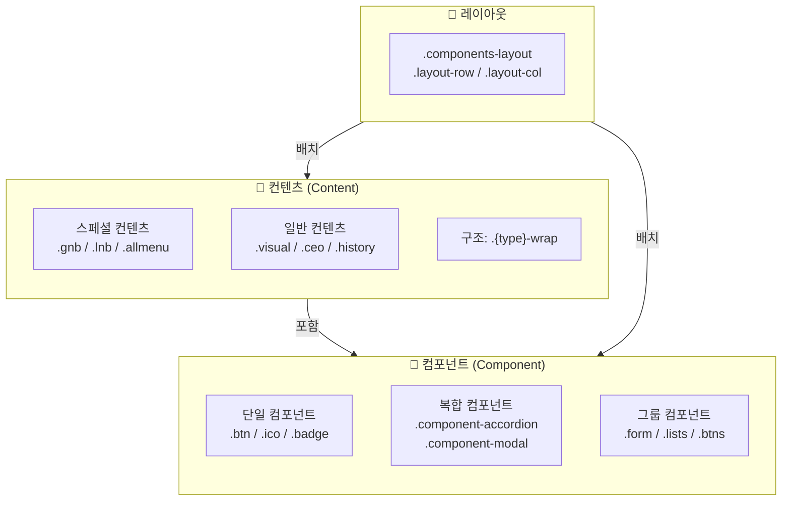

# 컨텐츠와 컴포넌트

## 개요 다이어그램



## 컨텐츠 (Content)

- **정의**: 웹 페이지나 애플리케이션에 표시되는 실제 데이터나 정보로, 주로 텍스트, 이미지, 링크, 또는 특정한 정보 구조를 포함합니다.
- **특징**:
  - 사용자에게 직접 제공되는 정보나 데이터입니다.
  - 주로 텍스트, 이미지, 비디오 등의 형태로 존재합니다.
  - 데이터베이스나 API를 통해 제공받은 정보를 포함할 수 있습니다.
  - 변경되거나 업데이트될 수 있는 정보입니다.
- **예시**:
  - 연혁 (History)
  - CEO 인사말 (CEO Message)
  - GNB (Global Navigation Bar)
  - LNB (Local Navigation Bar)

## 컴포넌트 (Component)

- **정의**: UI를 구성하는 재사용 가능한 코드 단위로, 특정 기능이나 인터랙션을 담당합니다.
- **특징**:
  - 재사용 가능하고 독립적인 UI 단위입니다.
  - 상태를 가질 수 있으며, 상호작용을 처리합니다.
  - HTML, CSS, 자바스크립트를 포함하여 기능과 스타일을 정의합니다.
  - props를 통해 데이터를 받아서 렌더링합니다.
  - 다양한 컨텐츠를 담을 수 있으며, 컨텐츠와 분리된 구조와 로직을 가집니다.
- **예시**:
  - 버튼 (Button)
  - 아이콘 (Icon)
  - 아코디언 (Accordion)
  - 모달 (Modal)

## 일반 컨텐츠 클래스

### 약속어

```css
/* 스페셜 컨텐츠 */
.gnb {}
.lnb {}
.allmenu {}
.utilmenu {}

/* 컨텐츠 */
.visual {}
.ceo {}
.company {}
.history {}
.../* 컨텐츠에 맞게 생성 */;
```

### 구조

```css
/* 컨텐츠 구조 */
.컨텐츠유형-wrap {
}
.컨텐츠유형-속성클래스 {
}

.컨텐츠유형-dimm {
}
.컨텐츠유형-spinner {
}
```

### 예제

```scss
/* 작성 예제 */
.ceo-wrap {
  .ceo-head {
    .head-info {
    }
  }
  .ceo-body {
    .intro-txt {
    }
  }
  .ceo-foot {
    .foot-sub-txt {
    }
  }
}
.ceo-dimm {
}
.ceo-spinner {
}
```

## 단일 컴포넌트 클래스

### 약속어

```css
.skipnav {}
.browserupgrade {}
.logo {}

.btn {}
.badge {}
.ico {}
.../* 추가시 협의 필요 */;
```

### 구조

```css
/* 컴포넌트 구조 */
.skipnav- {
}
.browserupgrade- {
}
.logo- {
}

/* 단일 컴포넌트 공통 클래스 */
.btn {
}
.ico {
}
.badge {
}
```

### 예제

```html
<!-- 작성 예제 -->
<button type="button" class="btn btn-cancel"></button>
<button type="button" class="btn btn-confirm"></button>
<button type="button" class="btn btn-primary"></button>

<i class="ico ico-normal ico-close" aria-hidden="true"></i>
<i class="ico ico-normal ico-refresh" aria-hidden="true"></i>

<span class="badge badge-style01 badge-color01"></span>
```

## 복합 컴포넌트 클래스

### 약속어

```css
/* 복합 그룹 컴포넌트 */
.hgroup {
}
.chips {
}
.btns {
}
.form {
}
.lists {
}
.carousels {
}

/* 복합 컴포넌트 */
.chip {
}
.input {
}
.checkbox {
}
.radio {
}
.select {
}
.dropdown {
}
.progressbar {
}

.tab {
}
.card {
}
.table {
}
.step {
}
.accordion {
}
.breadcrumb {
}
.pagination {
}
.swiper {
}
.carousel {
}
.thumbnail {
}

.empty {
}
.complete {
}
.spinner {
}
.skeleton {
}
.lottie {
}

/* 복합 레이어 컴포넌트 */
.modal {
}
.popup {
}
.dialog {
}
.alert {
}
.picker {
}
.calendar {
}
.tooltip {
}
.snackbar {
}
.toast {
}

/* 추가시 협의 필요 */
```

### 구조

```css
/* 복합 컴포넌트 구조 */
.component-컴포넌트유형 {
}
.컴포넌트유형-속성클래스 {
}

.컴포넌트유형-dimm {
}
.컴포넌트유형-spinner {
}
.컴포넌트유형-skeleton {
}

/* 복합 그룹 컴포넌트 구조 */
.component-컴포넌트유형 {
}
.컴포넌트유형-row {
}
.컴포넌트유형-col {
}

/* 레이어 컴포넌트 구조 */
.component-컴포넌트유형 {
}
.컴포넌트유형-frame {
}
.컴포넌트유형-container {
}
.컴포넌트유형-header {
}
.컴포넌트유형-content {
}
.컴포넌트유형-footer {
}
.컴포넌트유형-close {
}

.컴포넌트유형-dimm {
}
.컴포넌트유형-spinner {
}
.컴포넌트유형-skeleton {
}
```

### 예제

```scss
/* 복합 컴포넌트 작성 예제 - accordion */
.component-accordion {
  .accordion-head {
    .head-tit {
    }
  }
  .accordion-body {
    .body-view {
    }
  }
  .accordion-foot {
    .foot-info {
    }
  }
}

/* 복합 그룹 컴포넌트 구조 */
.component-form {
}
.form-row {
}
.form-col {
}

/* 레이어 컴포넌트 작성 예제 - modal */
.component-modal {
  .modal-frame {
  }
  .modal-container {
  }
  .modal-header {
  }
  .modal-content {
  }
  .modal-footer {
  }
  .modal-close {
  }
}
.modal-dimm {
}
.modal-spinner {
}
```

## 컨텐츠 & 컴포넌트의 클래스 작성 구조

```scss
/* 컨텐츠 클래스 구조 */
.컨텐츠유형-wrap {
	.컨텐츠유형-속성클래스 {}
	.컨텐츠유형-속성클래스 {}
	.컨텐츠유형-속성클래스 {}
}

/* 컴포넌트 클래스 구조 */
.component-컴포넌트유형 {
	.컴포넌트유형-속성클래스 {}
	.컴포넌트유형-속성클래스 {}
	.컴포넌트유형-속성클래스 {}
}

/* 유의 사항 */

/*
 * [O] 시맨틱 태그 선택자 - 허용
 * 이유: 태그 자체가 명확한 의미와 역할을 가지고 있어
 *       코드만 보고도 구조와 목적을 파악할 수 있습니다.
 */
.component-accordion {
	h1 { O }
	h3 { O }
	header { O }
	article { O }
	section { O }
	footer { O }
}

/*
 * [X] 범용 태그 선택자 - 지양
 * 이유: 태그 자체에 의미가 없어 어떤 역할을 하는지 알 수 없고,
 *       컴포넌트 내에서 여러 번 사용될 경우 스타일 충돌이 발생합니다.
 *       반드시 의미 있는 클래스명을 부여해야 합니다.
 */
.component-accordion {
	p { X }
	div { X }
	span { X }
}

/*
 * [O] 컴포넌트 접두어를 포함한 클래스 - 허용
 * 이유: 클래스명에 컴포넌트 유형(accordion-)이 포함되어 있어
 *       소속이 명확하고 다른 컴포넌트와 충돌하지 않습니다.
 */
.component-accordion {
	.accordion-sub-copy { O }
	.accordion-txt { O }
	.accordion-item { O }
	.accordion-box { O }
}

/*
 * [X] 독립적인 네이밍의 클래스 - 지양
 * 이유: 컴포넌트와의 연관성이 없는 클래스명은 소속이 불분명하고,
 *       전역 스타일과 충돌할 위험이 있으며 유지보수가 어렵습니다.
 */
.component-accordion {
	.txt-rank { X }
	.temp-rank { X }
}
```

## 컨텐츠 & 컴포넌트 레이아웃 클래스

- `components-layout` 은 컴포넌트 또는 컨텐츠의 레이아웃이 필요한 경우 사용합니다.
- 레이아웃에 관련된 스타일 클래스 ( `components-layout` )는 주로 두 가지 방법으로 정리하는 것이 좋습니다. 자주 사용되는 일반적인 레이아웃 스타일은 `layout.css` 파일에 모아두세요. 반면, 특정 내용이나 컴포넌트에만 적용되는 레이아웃 스타일은 각각의 `카테고리.css` 파일에 따로 정리하는 것이 좋습니다.
- 예를 들어 `ceo.html` 에서 특정 레이아웃이 발생해서 `components-layout` 을 사용해야 할때 `.components-layout-compnay` 또는 `.components-layout-ceo` 라는 클래스를 만들고 해당 클래스는 `company.css` 파일에 정리를 하는 것 입니다.
- 물론, `components-layout` 을 사용하지 않고 `.ceo-wrap` 에서 처리 할 수 있다면 더 좋을 것 같습니다.
- 주의사항으로 `components-layout` 자식으로 포함되는 컨텐츠 및 컴포넌트 클래스들은 레이아웃과 관련된 속성들만 컨트롤 합니다. 컨텐츠 구성 스타일은 해당 `카테고리.css` 에서 컨트롤 하고 컴포넌트 구성 스타일은 해당 `컴포넌트.css` 에서 컨트롤 합니다.

```html
<!-- 1번 샘플 -->
<div class="components-layout">
  <div class="layout-row">
    <div class="layout-col">
      <div class="visual-wrap"></div>
    </div>
    <div class="layout-col">
      <div class="component-lists"></div>
    </div>
  </div>
  <div class="layout-row">
    <div class="layout-col">
      <div class="component-form"></div>
    </div>
    <div class="layout-col">
      <div class="component-btns"></div>
    </div>
  </div>
</div>

<!-- 2번 샘플 -->
<div class="components-layout-company">
  <div class="layout-company-row">
    <div class="layout-company-col">
      <div class="ceo-wrap"></div>
    </div>
    <div class="layout-company-col">
      <div class="history-wrap"></div>
    </div>
  </div>
  <div class="layout-company-row">
    <div class="layout-company-col">
      <div class="about-wrap"></div>
    </div>
    <div class="layout-company-col">
      <div class="bi-wrap"></div>
    </div>
  </div>
</div>
```

```scss
/* 1번 샘플 */
.components-layout {
  .layout-row {
    @include flex-grid((1, 1), 4); // flex-grid mixin 사용
  }
  [class^="layout-col"] {
  }

  .visual-wrap {
  }
  .component-lists {
  }
  .component-form {
  }
  .component-btns {
  }
}

/* 2번 샘플 */
.components-layout-company {
  .layout-company-row {
    @include flex-grid((1, 1), 4); // flex-grid mixin 사용
  }
  [class^="layout-company-col"] {
  }

  .ceo-wrap {
  }
  .history-wrap {
  }
  .about-wrap {
  }
  .bi-wrap {
  }
}

/* 컨텐츠 & 컴포넌트 레이아웃 클래스 및 구조 예제 */
.components-layout-유형 {
  .layout-유형-row {
  }
  [class^="layout-유형-col"] {
  }
  .layout-유형-col-1 {
  }
  .layout-유형-col-2 {
  }

  // 간격, 꾸밈 등 부가적인 스타일만 아래에 정리
  .ceo-wrap {
  }
  .history-wrap {
  }
  .component-accordion {
  }
  .component-btns {
  }
}
```

## 유형 확장 클래스 작성 방법

### 기본형식

```scss
/* 컨텐츠 확장 */
.ceo-wrap {
}
.ceo-wrap-type02 {
}
.ceo-wrap.bg01 {
}

/* 단일 컴포넌트 확장 */
.btn-primary {
}
.btn-primary-type02 {
}
.btn-primary.round {
}

/* 복함 컴포넌트 확장 */
.component-card {
}
.component-card-type02 {
}
.component-card.bg02 {
}
```

### 예제

```scss
/* 기본 유형 */
.component-accordion {
  .accordion-group {
    .txt-name {
    }
  }
}

/* 완전 다른 유형일 경우 */
.component-accordion-type02 {
  /* 완전 다른 네이밍이 됩니다. */
  .accordion-type02-group {
    .txt-name {
    }
  }
}

/* 같은 유형 스타일이 다른 경우 */
.component-accordion {
  /* 기존 네이밍을 따라 가고 추가 클래스를 통해서 확장 합니다. */
  &.round {
    .accordion-group {
      .txt-name {
      }
    }
  }
  &.bg01 {
    .accordion-group {
      .txt-name {
      }
    }
  }
  &.type02 {
    .accordion-group {
      .txt-name {
      }
    }
  }
}
```

## 감싸는 클래스 작성 방법

```html
<!-- 기본 유형 -->
<div class="component-accordion">
  <div class="accordion-head"></div>
</div>

<!--
	갑작스런 감싸는 영역이 필요한 경우
	-sup 접미사를 붙여 줍니다.
-->
<div class="component-accordion">
  <div class="accordion-head-sup">
    <div class="accordion-head"></div>
  </div>
</div>

<!--
	갑작스런 감싸는 영역이 필요한 경우
	-sup 접미사를 붙여 줍니다.
-->
<div class="component-accordion-sup">
  <div class="component-accordion">
    <div class="accordion-head"></div>
  </div>
</div>
```

## Quick Reference

| 유형          | 접두어              | 예시                         |
| ------------- | ------------------- | ---------------------------- |
| 컨텐츠        | `{type}-wrap`       | `.ceo-wrap`, `.history-wrap` |
| 단일 컴포넌트 | (없음)              | `.btn`, `.ico`, `.badge`     |
| 복합 컴포넌트 | `component-`        | `.component-accordion`       |
| 레이아웃      | `components-layout` | `.components-layout-company` |