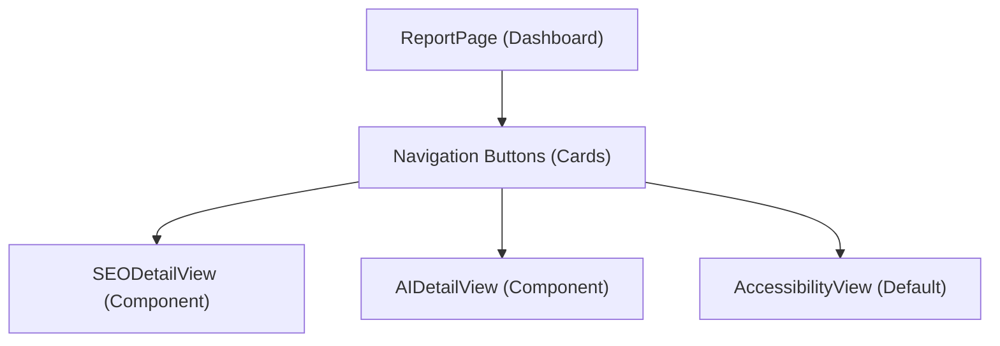

# Proposal: SEO & AI Result UI/UX Refactoring

본 문서는 현재 한 페이지에 통합되어 표시되는 SEO 최적화 분석과 AI 친화도(GEO) 분석 결과를 각각의 전문화된 상세 페이지로 분리하여 제공하기 위한 개편 기획안입니다.

## 📋 목적
- **정보 과부하 방지**: 한 화면에 너무 많은 정보를 노출하지 않고, 사용자가 관심 있는 분야에 집중할 수 있도록 개선합니다.
- **분석의 전문성 강화**: 각 분야(SEO, AI)에 특화된 레이아웃과 추가 지표를 제공할 공간을 확보합니다.
- **보고서 편의성**: 특정 리포트만 별도로 인쇄하거나 캡처하기 용이한 구조를 구축합니다.

---

## 🏗️ 개편 설계안

### 1. 종합 대시보드 (Overview)
현재의 `ReportPage`를 슬림화하여 전체적인 상태를 한눈에 파악할 수 있는 허브 역할을 수행하도록 합니다.
- **기능**: 세 개의 주요 진단 영역(접근성, SEO, AI)의 점수와 요약 텍스트 표시
- **네비게이션**: 
  - `[SEO 상세 분석 보기 >]` 버튼 추가
  - `[AI 친화도 상세 분석 보기 >]` 버튼 추가

### 2. SEO 상세 분석 페이지 (SEO Detail View)
기존의 `📊 SEO 최적화 분석` 섹션을 독립된 뷰로 확장합니다.
- **상세 데이터**:
  - Sitemap.xml 구조 및 robots.txt 참조 상태
  - 메타데이터(Title, Description, Canonical) 정밀 진단
  - `seo-analyzer`의 정밀 결함 리포트 목록
- **특화 기능**: SEO 최적화 프롬프트 복사 버튼 배치

### 3. AI 친화도 상세 분석 페이지 (AI/GEO Detail View)
기존의 `🤖 AI 친화도 분석 (GEO)` 섹션을 독립된 뷰로 확장합니다.
- **상세 데이터**:
  - `llms.txt` 구조 및 규칙 위반 내역
  - 가독성 지표(Flesch-Kincaid) 및 내용 품질 점수
  - GEO(Generative Engine Optimization) 특화 지표 (Citability, Claim Density)
- **특화 기능**: AI 전문가 프롬프트 및 생성 가이드 도구 배치

---

## 🛠️ 기술적 구현 계획

### 데이터 흐름
- `localStorage`에 저장된 통합 `auditResult`를 공유하며, 상위 컴포넌트의 `state` 또는 `Next.js Routing`을 통해 현재 보고 싶은 뷰를 전환합니다.

### 컴포넌트 구조 (Refactoring)

### 단계별 작업
1.  **Phase 1**: `SEOResultDisplay`를 `SEODetailView`와 `AIDetailView`로 분리
2.  **Phase 2**: `ReportPage` 상단에 뷰 전환용 탭(Tab) 또는 카드형 버튼 배치
3.  **Phase 3**: 선택된 뷰에 따라 상세 리포트를 조건부 렌더링하도록 `ReportPage` 수정
4.  **Phase 4**: 각 상세 뷰에 최적화된 애니메이션 및 전용 UI 컴포넌트 추가

---

## 📈 개선 기대 효과
- **사용자 경험(UX)**: 더 깔끔하고 정돈된 인터페이스 제공
- **확장성**: 추후 새로운 분석 도구(예: Performance, Security) 추가 시 페이지를 별도로 구성하기 용이함
- **전문 이미지**: 사용자가 서비스를 더욱 체계적이고 전문적인 도구로 인식하게 함
